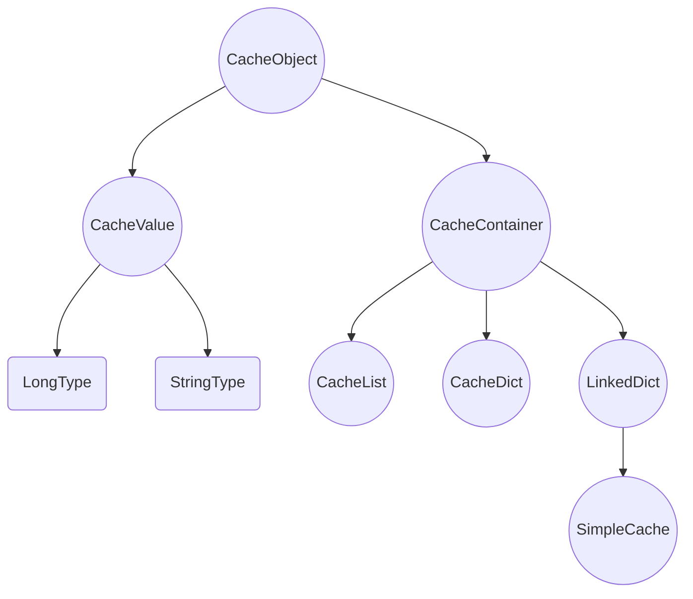
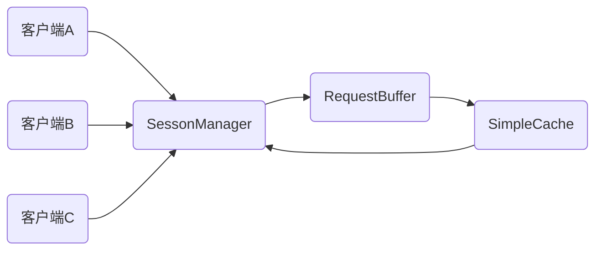

scache是一个简单的缓存中间件，支持int/long，string，list，dict等常用数据类型的缓存。支持对缓存对象进行增删读改，支持缓存对象过期。

## 数据类型

整个的缓存就是一个大的哈希表，为了在表中存储多种不同类型的数据，SimpleCache中所有的缓存数据都封装为CacheObject。CacheObject的继承关系如图所示。注：其中圆形表示实际代码中实际创建的类型。而LongType和StringType实际上并不存在对应的类，而是统一使用CacheValue来封装和存储。通过模板函数来设置或者返回不同类型的数据。



* CacheObject：具有最基础的两个数据成员：key和type。在dict类型中(包括SimpleCache)，key不可缺省且唯一。而在CacheList中，key可以缺省，可以重复，仅作为辅助标记。type为常量，在CacheObject对象创建时初始化，不可更改，表示一个CacheOject的具体类型。type成员是枚举类型，目前可选的类型包括：LongType，StringType，ListType，DictType，LinkType。

* CacheValue：继承自CacheObject，增加了一个void类型指针，用于存储数据。数据类型可能为整型数或者字符串(理论上可以支持所有类型，但是在具体的使用中，只做了对整型数和字符串的支持，所谓的支持表现在CacheValue的析构上，必须知道明确的数据类型，才可以对void指针指向的数据进行正确的析构和空间回收)，使用type成员来区分。


* CacheContainer：抽象类，包括addKeyValue，getKeyValue，delKeyValue三个虚函数接口。


* CacheList：双链表结构，使用额外的CacheListNode结构对CacheObject及其派生类进行了再一层的封装，方便实现链表的各种操作。CacheListNode包含了指向上一节点和下一节点的指针。

* CacheDict：鉴于重新实现了一个功能齐全，可靠高效的哈希字典工作量较大，也比较复杂，此处采用了对std::unordered_map进行封装的方式来实现CacheDict。

* LinkedDict：CacheDict和CacheList的组和结构，提供字典和链表的所有功能。

* SimpleCache：继承自LinkedDict，重写了addKeyValue，getKeyValue，delKeyValue三个虚函数，增加了过期时间表，锁表等结构和相关的操作方法。整个的缓存空间，就是一个大的SimpleCache对象。

**为了保证所有的缓存对象都在堆上，所有的CacheObject及其派生类(除了SimpleCache)，的构造函数和析构函数都被声明为protected，避免在外部直接创建CacheObject及其派生类对象。之后，提供一个getInstance函数，并将该函数声明为各个类的友元函数，通过getInstance来创建和返回CacheObject及其派生类的堆上对象。**

## 关键结构

以下四个数据结构分别负责：数据管理，数据传输，连接管理，配置管理。每个结构全局唯一，使用单例模式来保证唯一性。其构造函数被声明为私有，使用一个get\<类型名\>函数来获取唯一的一个实例。每个get\<类型名\>函数内都有一个对应类型指针的静态局部变量，该变量只会被初始化一次。之后每一次调用get\<类型名\>函数都会返回该指针。

* SimpleCache：缓存数据的实际管理者，全局唯一。提供缓存操作的相关API，包括增删查改以及缓存对象。所有的缓存对象管理和组织在一个LinkedDict中。

* SessionManger：所有连接的管理者，全局唯一。接受外部连接和请求，负责连接(Session)的创建和销毁。整个缓存系统数据的输入端和输出端。所有的连接保存在一个字典中，使用IP地址和端口号组成的字符串作为key。

* RequestBuffer：数据流动的核心枢纽，全局唯一。所有对SimpleCache的操作都必须经过RequestBuffer来传达，目前来说：SimpleCache消费RequestBuffer中的请求，而SessionManager和定时过期检查(过期策略中详述)向RequestBuffer中添加请求。

* GlobalConfig：scache的相关配置项，如检查过期缓存对象周期，缓存空间上限，Session过期时间，对象锁过期时间等，监听端口等。可以通过命令行启动参数对其具体的值进行配置，全局唯一。



## 请求处理

在当前的实现中，scache一共有三个线程来协同为客户端提供数据缓存服务：
* 线程1：监听和数据请求预处理。负责监听端口，建立连接，接收客户端数据并进行解析和预处理，将数据封装成为Reqeust(Request中包含对应连接的ip:port，以及初步解析之后的请求数据)，并添加到RequestBuffer中。
* 线程2：不断从RequestBuffer中获取请求并进行请求的处理，最后根据Request中的ip:port将处理结果发送给对应客户端。线程2是唯一一个可以直接对SimpleCache进行修改的线程。所有涉及数据修改的操作都必须发布到RequestBuffer中并由线程2处理。保证只有一个线程可以直接修改数据，不但可以避免因为多线程同时操作缓存数据而带来的数据一致性问题，也避免了对缓存数据进行频繁而复杂的加锁和解锁。
* 线程3： 定时任务，周期性检查SimpleCache中缓存对象是否过期。假设某个数据对象过期，则在RequestBuffer中添加一个del key请求来删除该对象。

一个客户端从建立连接到处理数据请求到连接断开的完整流程如下：
```sequence
客户端->线程1: 连接请求
线程1->客户端: 连接建立，创建对应Session
客户端->线程1: 发生请求指令
线程1->线程2: 将请求添加到RequestBuffer
线程2->线程1: 从RequestBuffer读取请求
线程2->客户端: 请求处理结果
客户端->线程1: 断开连接
线程1->客户端: 连接断开
```

## 淘汰策略

采用基于LRU的数据淘汰策略，LRU是一种经典的缓存数据替换算法，SimpleCache本身使用LinkedDict实现也是为了方便实现LRU淘汰和替换策略。

每当一个数据对象被访问(读或者写)，该数据对象就会被移动到所在链表的首部(一个O(1)的操作)。所以每次链表尾部就是最长时间未访问的数据对象，优先被淘汰。

数据对象淘汰采用懒惰淘汰机制，当发生数据添加操作时，会检查当前SimpleCache大小是否超过预设的缓存空间上限，是，则将SimpleCache链表末尾的数据项进行淘汰。在其他情况下，除了因为过期而删除的数据对象之外，不会主动回收空间。

## 过期策略

采用懒惰检查和定期主动检查相结合的方法。
懒惰检查：在对缓存数据访问前，首先会检查该key对应对象是否过期，假设过期则将该对象删除并返回“对象不存在”的错误信息。
主动检查：周期性检查SimpleCache中对象是否过期，SimpleCache本身为LinkedDict，并且支持LRU的淘汰替换策略，其链表末尾就是最长时间未访问的数据对象。因此主动检查从链表末尾开始检查。每当一个数据对象被确定为过期，则主动检查会向RequestBuffer中添加一个删除请求。

## 指令支持

以下是scache缓存暂时支持的所有指定集合。其中加粗项为指令关键字，中括号中为可选项，圆括号中为数据可能类型。关键字，key和value之间使用空格分隔。如果key或者value本身为包含空格的字符串，必须使用双引号包围起来。此外，目前scache的指令解析不支持双引号的嵌套，假设需要缓存的数据内部包含双引号，请使用单引号替代。

### 键值指令

* **set** key(string) value(int/long/string) [**expire** time(long)]
在缓存中插入key-value对或者更新key-value对，可以通过设置expire来设置过期时间。其中expire是可选项。注：无法直接在缓存中插入一个字典或者链表，只有使用字典指令以及链表指令时，如果对应链表不存在，会自动创建一个所需的链表或字典。
* **get** key(string)
读取对应的对象。假设key对应的value为链表或者字典类型，则返回链表/哈希表数据类型信息。
* **expire** key(string) time(long)
设置键值对过期时间，只支持对顶级的key-value设置过期时间。举例而言，一个对象A存储于一个字典或者链表中，而该字典或链表是缓存空间中某个key-value对中的value，则对象A不可设置单独的过期时间。
* **del** key(string)
删除键值对并回收内存空间。

### 字典指令
* **dset** key1(string) key2(string) value(int/long/string)
向次级字典中插入或者更新一个key-value对。key1为该字典本身对应的键，而key2则和value组成字典中的键值对。
* **dget** key1(string) key2(string)
在key1对应的字典中搜索key2
* **ddel** key1(string) key2(string)
删除key1对应的字典中key2对应的键值对。

### 链表指令
* **ladd** key(string) value(int/long/string)
向key对应的链表中添加value对象，新建对象的key缺省。
* **ladd** key1(string) key2(string) value(int/long/string)
向key1对应的链表中添加value对象，新建对象的key为key2。
* **lpop** key(string)
从key对应的链表中末尾弹出一个对象，并将其返回
* **lpop** key1(string) key2(string)
从key对应的链表中弹出key为key2的对象。该操作需要遍历链表进行搜索，慎用。
* **lget** key1(string) key2(string)
从key对应的链表中获取key为key2的对象。该操作需要遍历链表进行搜索，慎用。
* **lall** key(string)
返回链表中所有的对象。以key1 value1 \r\n key2 value2......的形式返回，部分key缺省，以(empty)替代之。遍历链表，操作量大，慎用。

### 加锁解锁

scache同时只有一个线程对缓存数据进行写操作，以避免多个线程同时写缓存导致的数据一致性和同步问题。但是在多用户情况下，仍旧有可能出现数据不一致的情况(参考**一致性保证**)。因此，提供lock和unlock两个指令来对某个数据对象进行锁定和解锁，避免数据操作不一致。

* lock key
锁定某个对象，之后其他客户端暂时不能操作该对象。锁保持时间可以通过启动参数进行配置。
* unlock key
解锁某个对象。

### 指令返回

* **ok** [message]
正确完成操作。
* **error** [message]
操作未能完成，主要有：。

## 连接管理

scache的网络I/O部分基于boost.asio来实现。为了实现连接的管理，scache对boost提供的socket进行了一定的封装，封装为一个名为Session的类。其中关键数据成员有：socket(m_sock)，缓存空间(m_buffer），最近访问时间(m_lastAccess)，定时器(m_deadTimer)。

* 缓存空间：用于异步接受客户端数据以及缓存待发送数据。

* 最近访问时间：记录最近一次客户端发起请求的时间戳。

* 定时器：用于客户端的超时销毁。

每次客户端发起请求，服务端从缓存空间读取数据之后，都会重新设置最近访问时间。而每次定时器超时之后，其回调函数都会检查当前时间和最近访问时间之间的时间差，如果时间差大于一定的阈值(可通过启动参数配置)，则主动断开连接并销毁当前Session。否者重新设置定时器的倒计时，新倒计时等于阈值减去时间差。

为了提高scache的效率，请求数据的读取和请求解析，请求处理和返回数据的写回由两个不同的线程来完成(参考**请求处理**)。因此，为了高效、正确的向发起请求的客户端返回数据，有必要对多个Session进行有效的管理。该功能和对应数据结构由SessionManager来实现(参考**关键结构**)。所有已经建立的Session都存储在一个连接字典中，使用ip:port作为关键字。

* Session建立：每当一个客户端发起连接请求就会为客户端创建一个Session，并添加到对应的字典。

* Seesion读取：每当Session建立，就会启动一个异步读操作，读取数据存储在Session的缓存空间(m_buffer)中，该异步读操作的回调函数会对读取结果进行解析并封装为Request添加到RequestBuffer中。

* Seesion写入：当一个请求处理完成之后，根据Request中ip:port从连接字典中获取对应Session，并调用其异步写回方法。异步写回方法的回调函数会再次启动该Session的一个异步读操作，实现请求->处理->写回->再请求的循环。

* Session销毁：当一个客户端主动关闭连接，Session将被销毁并从连接字典中移除。当一个Session超时，其超时回调函数同样会执行Session的销毁以及移除。


## 一致性保证

在scache中，只有一个线程可以直接对缓存空间数据修改，保证了不会因为多线程的争用而出现数据的一致性问题，但是在具有多个客户端的情况下，仍旧可能出现数据的不一致，因为很多操作并不是原子的或者在一个请求之内完成的。举例而言，客户端A和客户端B先后获取了缓存中一个整型数X，各自将X加上了十，并将结果写入到缓存中。假设客户端A和客户端B的请求时间相近，在一个客户端完全完成操作之前，另一个客户端也正在进行该操作，那么最终的结果可能就会出现问题。如下图所示。X原本为30，客户端A和B都对X增加10，最终结果应该是50。但是由于两个客户端请求的交错，最终X的结果为40，出现了数据的不一致。

```sequence
客户端A->服务端: 获取X
服务端->客户端A: X=30
客户端B->服务端: 获取X
服务端->客户端B: X=30
客户端A->服务端: 设置X=X+10=40
客户端B->服务端: 设置X=X+10=40
```

为了保证数据的一致性，scache提供了加锁命令，由客户端判断自己的操作是否需要加锁。当一个对象被锁定之后，其他客户端将无法操作该对象。为了避免某个客户端锁定某个对象后忘记解锁或着该客户端发生故障不能及时解锁，每次锁定都具有时间限制。

所有的锁都存储在一个哈希表中，使用数据对象的key为key，而value则是时间戳和客户端ip::port的结构体。当需要对某个对象进行操作时，首先会搜索该哈希表，并检查该锁是否超时，如果超时，则将其删除；如果未超时，进一步检查Request中客户端名称和锁中客户端名称是否匹配。